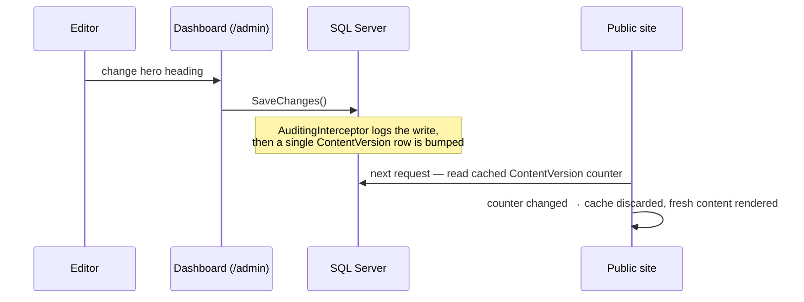

# Khedma — CMS-Driven Business Platform

**A bilingual public website with a full admin dashboard sharing one database and one media folder — so the dashboard can never drift from the site it claims to manage.**

> This is a **case study**, not a source dump. `Khedma`'s source code is private. This repository documents its architecture, business rules and engineering decisions in enough depth for another engineer to evaluate the work, without exposing implementation code, credentials, or deployment infrastructure.

---

## 1. The problem

Most "admin panel + website" pairs are built as two separate applications that read from the same data but were never designed as one system. In practice they drift: the panel lets you edit something the site doesn't render yet, or the site caches a value the panel just changed, and the two disagree until someone remembers to restart something.

Khedma is built so that can't happen — because the public site and the dashboard are the same application, reading and writing the same rows, with no second copy of the "truth" to fall out of sync.

## 2. What it is

A content-managed bilingual (Arabic RTL / English LTR) business website — portfolio, services, team, blog, testimonials — with a complete admin dashboard mounted inside the same application, plus an optional separate JSON API.

| Application | Role |
|---|---|
| **Khedma.Web** | The public website (Razor MVC), with the entire admin dashboard mounted as an MVC Area at `/admin` |
| **Khedma.WebApi** | Optional, separate-process JSON API + Swagger — read-focused, CORS-configurable |
| **Khedma.Application / Domain / Infrastructure** | Shared Clean Architecture core: entities, query/command services, EF Core, Identity, media pipeline |

## 3. System architecture

```mermaid
flowchart TD
    Visitor[Public visitor] -->|reads| Web[Khedma.Web — public site]
    Admin[Site owner / editor] -->|writes, authenticated| Dash["Khedma.Web /admin — dashboard Area"]
    Client[External client] -->|optional, read-focused| Api[Khedma.WebApi]
    Web --> App[Application layer]
    Dash --> App
    Api --> App
    App --> Infra[Infrastructure — EF Core, Identity, media]
    Infra --> DB[(SQL Server)]
    Infra --> Media[(Shared media storage)]
```

**The central idea.** The dashboard is an MVC *Area* inside the same web application as the public site — not a separate host. A content write in the dashboard and a page render on the public site read the exact same row, in the exact same request-response cycle model, because they're the same process talking to the same database.

**Why this matters for hosting, too.** A single-application hosting plan (a very real constraint outside a big cloud budget) can run the public site and the dashboard together as one deployable unit, while the optional API — which needs its own CORS and rate-limiting posture — stays a separate process.

### Cache invalidation without a cache-invalidation system

The public site caches settings, theme and navigation aggressively for performance. The problem that creates: a dashboard write from one process must be visible to a *different* process's cache (the optional API) without any explicit invalidation call.

No Redis, no pub/sub, no cache-invalidation call scattered through every service that writes content — one indexed integer read tells every reader whether its cache is still valid. It is architecturally impossible to add a new admin screen that "forgets" to invalidate the cache, because nothing has to remember to call anything.

## 4. Feature areas

Verified from the Application layer's own module boundaries:

`Achievements` · `Admin` · `Analytics` · `Blog` · `Contact` · `Cv` · `Projects` · `Services` · `Site` · `Team` · `Technologies` · `Testimonials`

### What's in the dashboard

Everything the public site renders is editable from the dashboard — nothing in it is a mock-up:

- **Website** — every page section (heading, sub-heading, body, button, with per-section visibility), navigation menus, "How we work" steps, social links
- **Content** — portfolio projects with full case studies, galleries, tech stack and team; services; team member profiles with experience, education and certifications; technologies; achievements; testimonials; a blog with categories and tags
- **Media library** — drag-and-drop upload; images are re-encoded to WebP, resized and thumbnailed; a file still referenced elsewhere cannot be deleted, and the dashboard tells you where it's used
- **CV management** — upload, version, and activate a CV per language; the public "download CV" button always follows whichever version is active
- **Messages** — contact form submissions and service requests, with status tracking and internal notes
- **Analytics** — first-party visitor analytics, no third-party tracking script
- **Appearance** — the public site's theme and the dashboard's own theme, configurable independently
- **Settings** — identity, contact details, footer, feature flags, maintenance mode, SEO
- **System** — user accounts, role/permission management, audit log

Both the public site and the dashboard are fully bilingual and responsive.

## 5. Database & domain model

34 domain entities, spanning content (`Project`, `Service`, `TeamMember`, `Article`, `Testimonial`, `Achievement`, `Technology`, `CvFile`), site configuration (`SiteSettings`, `ThemeSettings`, `NavigationItem`, `PageSection`), and operations (`AuditLog`, `ContentVersion`, `AnalyticsEvent`, `PageView`, `ContactMessage`, `ServiceRequest`).

Notable data-integrity rules, verified against the schema and enforced by the integration test suite:

- A **filtered unique index** guarantees exactly one *active* CV per language — the database itself, not application code, is what makes "two active English CVs" impossible.
- **Every create, update and delete is audited** from a single `SaveChanges` interceptor (`AuditingInterceptor`) — a new feature cannot ship without being audited, because logging happens below the feature code, not inside it.
- Deleting a media file that's still referenced anywhere is refused at the data layer, not just warned about in the UI.

## 6. API overview

The optional `Khedma.WebApi` is deliberately minimal and read-focused: a separate process (so it can carry its own CORS and rate-limiting policy) exposing the same content the public site renders, documented with Swagger/OpenAPI. It is not where content is authored — that happens exclusively through the dashboard, which is the one write path into the system.

## 7. Authentication & authorization

- **ASP.NET Core Identity** backs dashboard accounts.
- **First-run bootstrap is safe by construction**: the seeder creates one `SuperAdmin` account and, if no password was configured, generates a strong one and writes it to the startup log exactly once — it is never stored anywhere else, and never has a hardcoded default.
- **Permissions, not role names.** Controllers demand a specific permission claim (e.g. `projects.manage`), not a named role — so a new custom role can be granted any slice of the dashboard without a code change. `SuperAdmin` is the one unconditional exception, specifically so the owner can never lock themselves out of their own site.

## 8. Security & privacy architecture

- **Analytics without tracking.** No IP address is ever stored. Unique visitors are counted through a salted hash of IP + user agent + date — the hash lets the system count "a visitor" within a single day without being able to follow that visitor across days, and known bots are dropped before anything is written.
- **Sanitize on write, trust on read.** Rich text (article bodies, project case studies) is sanitized once, at save time — public pages render it unencoded, and the Content-Security-Policy never needs an `unsafe-inline` script exception to accommodate user content.
- **Antiforgery is enforced and tested**, not just present — the integration suite specifically verifies that a POST without a valid antiforgery token is rejected.
- **Spam is dropped silently.** A honeypot field on public forms is verified by the integration suite to silently discard spam submissions rather than surfacing an error that would help a bot iterate.
- **One stylesheet, not two.** Bidirectional layout (Arabic RTL / English LTR) uses CSS logical properties (`margin-inline-start`, `text-align: start`) throughout, so there's no separate mirrored stylesheet that can quietly drift out of sync with the primary one.

## 9. Testing strategy

| Suite | Files | Focus |
|---|---|---|
| Unit tests | 7 | Theme logic, slug generation, sanitizer behavior, analytics hashing, localization |
| Integration tests | 8 | Full HTTP pipeline against a real SQL Server database |

**106 xUnit test cases**, run in CI against a real SQL Server instance — not the in-memory EF Core provider — specifically because the platform's correctness depends on relational behavior an in-memory fake can't reproduce: the filtered unique index on the active CV, cascade delete rules, and a raw `UPDATE` statement that atomically bumps the content-version counter. Each test run creates and drops its own database.

Verified promises the suite actually checks: every route renders, draft content stays invisible to the public site, switching language changes both content and text direction, the dashboard is genuinely locked down to unauthenticated requests, a theme change saved in the dashboard reaches the public site, content writes bump the version counter and land in the audit log, the honeypot silently drops spam, and a POST without an antiforgery token is rejected.

## 10. Deployment & CI/CD

- The entire platform — public site and dashboard together — deploys as **one** ASP.NET Core application, by design, so it fits a single-application hosting plan.
- Every push builds and runs the full test suite against a real SQL Server instance in CI; a push to the default branch then deploys the website first (it's the process that applies database migrations), followed by the optional API.
- A deployment target with no secrets configured is skipped in CI rather than failing the pipeline — deployment targets can be brought online one at a time.
- All secrets (connection strings, admin bootstrap credentials) are supplied via environment variables at runtime; none exist in the repository or its history.

## 11. Engineering decisions worth calling out

- **Dependencies chosen to avoid licence traps.** SkiaSharp (MIT-licensed) for image processing instead of ImageSharp, whose v4 requires a paid commercial key for this kind of use; xUnit's own built-in assertions instead of FluentAssertions v8, which moved to a commercial licence. Nothing in the stack obligates a future purchase to keep building.
- **Auditing lives in the persistence layer, not in feature code.** Because `AuditingInterceptor` hooks `SaveChanges` directly, there is no code path for a new admin screen to accidentally ship without being audited — the alternative (each service remembering to log) is exactly the kind of thing that gets forgotten under deadline pressure.
- **The dashboard is an Area, not a second application**, specifically to fit a hosting constraint (one application slot) without sacrificing architectural cleanliness — the alternative (two hosts sharing a database) is what creates the drift problem this whole design avoids.

## 12. Tech stack

**Backend:** C# · .NET 10 · ASP.NET Core (MVC & Web API) · Entity Framework Core · SQL Server · ASP.NET Core Identity · FluentValidation

**Engineering:** Clean Architecture · Dependency Injection · xUnit · Integration testing against real SQL Server · Git & GitHub Actions CI/CD

**Media & content:** SkiaSharp (image processing) · HtmlSanitizer · Swashbuckle / OpenAPI

---

## Status

**Active development / in production use.**

## About this repository

Source code, credentials, and deployment infrastructure for Khedma remain private. This showcase exists to demonstrate the architecture, scope and engineering practice behind the project. No screenshots are included because the platform's UI review is still pending public release — this will be updated if that changes.

**Author:** Mohamed Abdelmoniem — [GitHub](https://github.com/default-z) · [LinkedIn](https://www.linkedin.com/in/mohamed-abdelmoniem-068845295/)
